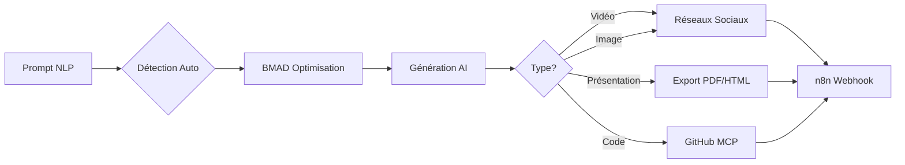

# 🎨 Studio Créatif IA Factory - Quick Start

> **Plateforme complète de création multimédia avec IA** (inspirée d'Abacus.AI)

## 🚀 Accès Rapide

```bash
http://localhost:8184/studio
```

## ✨ Fonctionnalités

### 🎯 Toolbar Principale
- **🖼️ Image** - 8 modèles AI (FLUX Pro, DALL-E, GPT Image...)
- **💻 Code** - Génération de code
- **🎮 Playground** - Tests interactifs
- **📊 Powerpoint** - Présentations automatiques
- **🔬 Deep Research** - Recherche approfondie

### ⋮ Menu "More" (12 outils)
- **🎬 Video-Gen** - Sora 2, Veo 3, Kling AI, Luma, Runway
- **👄 Lip Sync** - Hedra, OmniHuman
- **⭕ Humanize** - Conversion IA → Humain
- **📄 Doc-Gen** - Documents automatiques
- **✏️ Editor** - Éditeur riche
- **🌐 Scrape URL** - Extraction web
- **📸 Screenshot** - Captures
- **🎥 Video Analysis** - Analyse vidéo
- **☑️ Task** - Automatisation
- **🎤 Text-to-Speech** - ElevenLabs, OpenAI TTS
- **🎙️ Speech-to-Text** - Whisper
- **🔄 Speech-to-Speech** - Conversion vocale

### 🔌 MCP Servers (12+ intégrations)
- **GitHub, GitLab** - Code repositories
- **Playwright** - Web automation
- **Brave Search** - Recherche web
- **PostgreSQL, SQLite** - Databases
- **Google Tasks, Calendar** - Productivity
- **Slack, Notion, Drive** - Collaboration

## 📖 Utilisation

### Exemple 1: Vidéo
```
Tapez: "Une vidéo sur le Sahara algérien au coucher du soleil"
→ Détection auto: Video-Gen (Sora 2)
→ Génération
→ Publication: YouTube + TikTok + Instagram
```

### Exemple 2: Image
```
Tapez: "Logo moderne pour startup tech"
→ Détection auto: Image (FLUX Pro)
→ Génération
→ Diffusion: Instagram + LinkedIn
```

### Exemple 3: Code
```
Tapez: "Fonction Python pour analyser des logs"
→ Détection auto: Code
→ Génération du code
→ Export ou push GitHub (avec MCP)
```

## ⚙️ Configuration

### 1. Variables d'environnement (`.env.local`)

```bash
# LLM (pour BMAD)
GROQ_API_KEY=gsk_xxxxxxxxxxxxx
OPENAI_API_KEY=sk-xxxxxxxxxxxxx

# MCP Servers
GITHUB_TOKEN=ghp_xxxxxxxxxxxxx
BRAVE_API_KEY=BSA_xxxxxxxxxxxxx
```

### 2. Activer MCP Servers
1. Clic sur **🔌 MCP**
2. Sélectionner jusqu'à 5 serveurs
3. Configurer les credentials
4. Appliquer

### 3. Tester le workflow
1. Taper un prompt
2. Vérifier la détection automatique
3. Générer le contenu
4. Publier via n8n

## 🎯 Workflow Complet



## 📊 Limitations

- **MCP**: Max 5 serveurs, 50 outils/serveur (règle Abacus.AI)
- **Vidéo**: Selon providers (Sora 2, etc.)
- **Image**: Gratuit via Pollinations.ai

## 🔧 Troubleshooting

### MCP ne se connecte pas
```bash
# Vérifier la config
docker logs iaf-dz-studio --tail 50
```

### Backend BMAD offline
→ Mode démo local automatique

## 📚 Documentation Complète

[STUDIO_CREATIF_GUIDE.md](./docs/STUDIO_CREATIF_GUIDE.md)

## 🚀 Démarrage

```bash
# Démarrer tout
docker-compose up -d

# Studio seulement
docker-compose --profile studio up -d

# Vérifier les logs
docker logs iaf-dz-studio --follow
```

## 🎉 Fait !

Accédez au Studio: **http://localhost:8184/studio**

---

**Version**: 1.0.0 | **IA Factory Algeria** 🇩🇿
