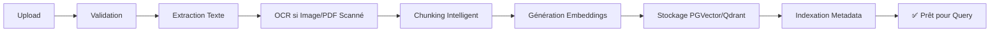

# 📄 Gestion de Documents - IA Factory

> **Uploadez et interagissez avec vos documents via notre interface LLM**

Uploadez vos documents (PDF, Word, Excel, images, vidéos) et discutez avec eux grâce à l'intelligence artificielle. Studio Créatif et Archon Hub extraient automatiquement le contenu et permettent des requêtes en langage naturel.

---

## 🚀 Démarrage Rapide

### Uploader des Documents

**Via Archon Hub (recommandé):**
```
http://localhost:8182
→ Onglet "Documents"
→ Bouton "Upload Files"
→ Glisser-déposer vos fichiers
```

**Via Docs UI:**
```
http://localhost:8183
→ "Upload Document"
→ Sélectionner fichiers
→ Cliquer "Process"
```

**Via Studio Créatif:**
```
http://localhost:8184/studio
→ Menu "More"
→ "Doc-Gen"
→ "Upload & Analyze"
```

---

## 📚 Formats Supportés

### Documents Texte

| Format | Extension | Taille Max | Limite Pages |
|--------|-----------|------------|--------------|
| **PDF** | `.pdf` | 50 MB | 2000 pages |
| **Word** | `.docx`, `.doc` | 30 MB | 2000 pages |
| **Excel** | `.xlsx`, `.xls` | 30 MB | 100 feuilles |
| **PowerPoint** | `.pptx`, `.ppt` | 30 MB | 500 slides |
| **Texte** | `.txt`, `.md` | 50 MB | Illimité |
| **CSV** | `.csv`, `.tsv` | 50 MB | 1M lignes |
| **JSON** | `.json` | 50 MB | - |

### Médias

| Format | Extension | Taille Max | Résolution Max |
|--------|-----------|------------|----------------|
| **Images** | `.jpg`, `.png`, `.gif`, `.webp` | 50 MB | 8000x8000 px |
| **Vidéos** | `.mp4`, `.mov`, `.avi` | 100 MB | 4K (3840x2160) |
| **Audio** | `.mp3`, `.wav`, `.m4a` | 50 MB | 2 heures |

### Code & Données

| Format | Extension | Taille Max | Notes |
|--------|-----------|------------|-------|
| **Python** | `.py` | 10 MB | Syntax highlighting |
| **JavaScript** | `.js`, `.ts`, `.jsx`, `.tsx` | 10 MB | React supporté |
| **HTML/CSS** | `.html`, `.css` | 10 MB | Preview disponible |
| **SQL** | `.sql` | 10 MB | Auto-formatting |
| **YAML/TOML** | `.yml`, `.yaml`, `.toml` | 5 MB | Config files |

---

## 📤 Méthodes d'Upload

### 1. Interface Web (Glisser-Déposer)

**Archon Hub:**

1. Aller sur http://localhost:8182/documents
2. Glisser vos fichiers dans la zone de dépôt
3. Attendre la progression (processing + vectorisation)
4. Confirmation: "✅ 5 documents uploaded successfully"

**Supports:**
- ✅ Upload multiple (jusqu'à 50 fichiers simultanés)
- ✅ Preview avant upload
- ✅ Validation automatique (format + taille)
- ✅ Progress bar en temps réel

---

### 2. API REST

**Endpoint:**
```http
POST /api/v1/documents/upload
Content-Type: multipart/form-data
Authorization: Bearer <token>

--boundary
Content-Disposition: form-data; name="file"; filename="document.pdf"
Content-Type: application/pdf

[binary data]
--boundary
Content-Disposition: form-data; name="metadata"
Content-Type: application/json

{
  "collection": "contracts",
  "tags": ["legal", "2025"],
  "language": "fr",
  "auto_process": true
}
--boundary--
```

**Response:**
```json
{
  "document_id": "doc_abc123",
  "filename": "document.pdf",
  "size_bytes": 1245678,
  "pages": 45,
  "status": "processing",
  "estimated_time_seconds": 30,
  "vectorization_job_id": "job_xyz789"
}
```

---

### 3. Python SDK

**Installation:**
```bash
pip install iafactory-sdk
```

**Usage:**
```python
from iafactory import IAFactoryClient

client = IAFactoryClient(api_key="your-api-key")

# Upload simple
with open("contract.pdf", "rb") as f:
    doc = client.documents.upload(
        file=f,
        collection="legal",
        tags=["contract", "2025"]
    )

print(f"Document ID: {doc.id}")
print(f"Status: {doc.status}")

# Upload multiple
documents = client.documents.upload_batch([
    "file1.pdf",
    "file2.docx",
    "file3.xlsx"
], collection="finance")

print(f"Uploaded {len(documents)} documents")

# Avec callback de progression
def progress_callback(current, total):
    print(f"Processing: {current}/{total} pages")

doc = client.documents.upload(
    file=open("big.pdf", "rb"),
    on_progress=progress_callback
)
```

---

### 4. CLI (Command Line)

**Installation:**
```bash
npm install -g @iafactory/cli
# ou
pip install iafactory-cli
```

**Usage:**
```bash
# Upload simple
iafactory docs upload contract.pdf

# Upload avec options
iafactory docs upload report.pdf \
  --collection "reports" \
  --tags "2025,quarterly" \
  --language "fr"

# Upload dossier complet
iafactory docs upload ./documents/ \
  --recursive \
  --filter "*.pdf,*.docx"

# Upload et attendre processing
iafactory docs upload large.pdf --wait

# Upload avec metadata JSON
iafactory docs upload data.csv \
  --metadata '{"source":"sales","year":2025}'
```

---

## 🔍 Traitement & Vectorisation

### Pipeline Automatique



### Étapes de Traitement

**1. Validation (< 1s)**
- Vérification format
- Contrôle taille
- Scan antivirus (ClamAV)

**2. Extraction Texte (variable)**
- **PDF**: PyPDF2 / PDFMiner (1-5s/page)
- **Word**: python-docx (< 1s)
- **Excel**: pandas (< 2s)
- **Images**: Tesseract OCR (2-10s/page)
- **Vidéos**: Whisper transcription (temps réel × 0.5)

**3. Chunking (1-3s)**
- Division en morceaux de 512-1024 tokens
- Préservation du contexte sémantique
- Overlap de 50 tokens entre chunks

**4. Vectorisation (0.5-2s/chunk)**
- Model: `all-MiniLM-L6-v2` (384 dimensions)
- Alternative: `text-embedding-ada-002` (OpenAI)
- Batch processing pour performance

**5. Stockage**
- PostgreSQL (PGVector) pour metadata + texte
- Qdrant pour recherche vectorielle rapide

---

## 🗂️ Gestion des Documents

### Visualiser les Documents

**Via Archon Hub:**

```
http://localhost:8182/documents
```

**Affichage:**
- 📄 Liste avec miniatures
- 🔍 Recherche par nom/tags
- 📊 Tri (date, taille, nom, type)
- 📁 Filtrage par collection
- 📈 Statistiques (pages, mots, taille)

**API:**
```http
GET /api/v1/documents?limit=50&offset=0&collection=legal
Authorization: Bearer <token>
```

**Response:**
```json
{
  "documents": [
    {
      "id": "doc_abc123",
      "filename": "contract_2025.pdf",
      "collection": "legal",
      "tags": ["contract", "2025"],
      "uploaded_at": "2025-01-18T10:30:00Z",
      "size_bytes": 1245678,
      "pages": 45,
      "status": "ready",
      "language": "fr",
      "chunk_count": 89,
      "preview_url": "/api/v1/documents/doc_abc123/preview"
    }
  ],
  "total": 234,
  "page": 1,
  "page_size": 50
}
```

---

### Rechercher dans les Documents

**Recherche Sémantique (Vector Search):**

```http
POST /api/v1/documents/search
Content-Type: application/json
Authorization: Bearer <token>

{
  "query": "clauses de résiliation dans contrats 2025",
  "collection": "legal",
  "limit": 10,
  "similarity_threshold": 0.7
}
```

**Response:**
```json
{
  "results": [
    {
      "document_id": "doc_abc123",
      "filename": "contract_2025.pdf",
      "chunk": "Article 12 - Résiliation...",
      "page": 8,
      "similarity_score": 0.92,
      "highlight": "Les clauses de <mark>résiliation</mark> prévoient..."
    }
  ],
  "query_time_ms": 45
}
```

**Recherche Full-Text (PostgreSQL):**

```http
POST /api/v1/documents/search/fulltext
Content-Type: application/json

{
  "query": "résiliation OR annulation",
  "filters": {
    "tags": ["contract"],
    "uploaded_after": "2025-01-01"
  }
}
```

---

### Supprimer des Documents

**Via Interface:**

1. Aller sur http://localhost:8182/documents
2. Sélectionner document(s)
3. Cliquer "Delete"
4. Confirmer (⚠️ action irréversible)

**Via API:**
```http
DELETE /api/v1/documents/doc_abc123
Authorization: Bearer <token>
```

**Response:**
```json
{
  "message": "Document deleted successfully",
  "deleted_chunks": 89,
  "freed_space_bytes": 1245678
}
```

**Suppression en masse:**
```http
POST /api/v1/documents/batch-delete
Content-Type: application/json

{
  "document_ids": ["doc_abc123", "doc_def456"],
  "confirm": true
}
```

---

### Mettre à Jour Metadata

**API:**
```http
PATCH /api/v1/documents/doc_abc123
Content-Type: application/json

{
  "tags": ["contract", "2025", "updated"],
  "collection": "legal-archived",
  "metadata": {
    "department": "Legal",
    "status": "reviewed"
  }
}
```

---

## 💬 Interagir avec les Documents

### Chat avec Documents

**Via Studio Créatif:**

```
http://localhost:8184/studio
```

**Exemple de conversation:**

```
User: "Résume le document contract_2025.pdf"

AI: "📄 Résumé de contract_2025.pdf (45 pages):

**Type**: Contrat de prestation de services
**Parties**: IA Factory Algeria & Client XYZ
**Durée**: 12 mois (janvier 2025 - décembre 2025)
**Montant**: 50,000 DA/mois

**Points clés:**
1. Prestation d'IA (chatbots, automatisation)
2. SLA: 99.5% uptime garanti
3. Support 24/7 inclus
4. Clause de confidentialité stricte
5. Résiliation: préavis de 30 jours

**Obligations IA Factory:**
- Maintenance plateforme
- Mises à jour sécurité
- Formation utilisateurs

**Obligations Client:**
- Paiement mensuel
- Fourniture données nécessaires
- Respect RGPD

Voulez-vous plus de détails sur une section particulière?"
```

**Interaction avancée:**

```
User: "Compare les clauses de résiliation entre contract_2025.pdf et contract_2024.pdf"

AI: "📊 Comparaison des clauses de résiliation:

**contract_2024.pdf (Article 15, p.12):**
- Préavis: 60 jours
- Pénalités: 20% du montant restant
- Restitution données: 30 jours

**contract_2025.pdf (Article 12, p.8):**
- Préavis: 30 jours ✅ Amélioré
- Pénalités: 10% du montant restant ✅ Réduit
- Restitution données: 15 jours ✅ Plus rapide

**Résumé:** Le contrat 2025 est plus favorable au client
avec des délais réduits et moins de pénalités."
```

---

### Questions par Type de Document

**📄 PDF / Word:**
```
"Résume ce document en 5 points"
"Extraire tous les montants et dates mentionnés"
"Quelle est la section sur la confidentialité?"
"Générer une to-do list basée sur ce contrat"
```

**📊 Excel / CSV:**
```
"Calcule la moyenne de la colonne 'ventes'"
"Trouve les lignes où le montant > 1000 DA"
"Crée un graphique des tendances mensuelles"
"Exporte les données filtrées en JSON"
```

**🎬 Vidéo:**
```
"Transcris cette vidéo en français"
"Résume les points clés de la présentation"
"À quel timestamp parle-t-on de pricing?"
"Générer des sous-titres en arabe"
```

**🖼️ Image:**
```
"Qu'est-ce qu'il y a dans cette image?"
"Extraire le texte de cette facture scannée (OCR)"
"Décrire cette infographie"
"Convertir cette image de tableau en CSV"
```

---

## 📊 Collections & Organisation

### Créer des Collections

**Collections = Folders thématiques**

```http
POST /api/v1/documents/collections
Content-Type: application/json

{
  "name": "Contrats 2025",
  "description": "Tous les contrats signés en 2025",
  "icon": "📄",
  "color": "#667eea",
  "permissions": {
    "read": ["team_legal", "team_finance"],
    "write": ["team_legal"],
    "delete": ["admin"]
  }
}
```

**Exemples de collections:**
- 📄 **Contrats** - Documents légaux
- 📊 **Rapports** - Analyses et statistiques
- 📚 **Documentation** - Guides et manuels
- 💰 **Finance** - Factures et comptabilité
- 🎓 **Formation** - Supports de cours
- 📧 **Emails** - Correspondances importantes

---

### Tags Automatiques

**IA Factory détecte automatiquement:**

```python
# Exemple de détection
document = "contract_2025.pdf"

auto_tags = detect_tags(document)
# Résultat:
{
  "type": "contract",
  "year": "2025",
  "language": "fr",
  "parties": ["IA Factory", "Client XYZ"],
  "topics": ["AI", "services", "SLA"],
  "sentiment": "neutral",
  "urgency": "normal"
}
```

**Vous pouvez aussi ajouter tags manuels:**
```
"legal", "reviewed", "signed", "urgent"
```

---

## 🔒 Sécurité & Confidentialité

### Contrôle d'Accès

**Niveaux de permissions:**

| Rôle | Upload | View | Delete | Share | Admin |
|------|--------|------|--------|-------|-------|
| **Admin** | ✅ | ✅ | ✅ | ✅ | ✅ |
| **Editor** | ✅ | ✅ | ✅ (own) | ✅ | ❌ |
| **Viewer** | ❌ | ✅ | ❌ | ❌ | ❌ |
| **Guest** | ❌ | ✅ (shared) | ❌ | ❌ | ❌ |

**API avec permissions:**
```http
GET /api/v1/documents/doc_abc123
Authorization: Bearer <token>

# Vérification automatique:
# - User a-t-il accès à cette collection?
# - Document est-il partagé avec user?
# - User est-il propriétaire?
```

---

### Chiffrement

**Au repos (Storage):**
- ✅ **AES-256-GCM** pour tous les fichiers
- ✅ Clés de chiffrement stockées dans HashiCorp Vault (optionnel)
- ✅ Rotation automatique des clés tous les 90 jours

**En transit (Upload/Download):**
- ✅ **TLS 1.3** obligatoire
- ✅ Certificats SSL/TLS valides
- ✅ HSTS activé

**Metadata:**
- ✅ Stockée dans PostgreSQL avec row-level security
- ✅ Logs d'accès complets
- ✅ Audit trail pour compliance

---

### Scan Antivirus

**Pipeline automatique:**

```
Upload → ClamAV Scan → Quarantine si suspect → Manuel review
                    ↓
                 ✅ Clean → Processing normal
```

**Configuration:**
```yaml
# docker-compose.yml (optionnel)
services:
  clamav:
    image: clamav/clamav:latest
    volumes:
      - clamav-signatures:/var/lib/clamav
    networks:
      - iafactory
```

---

### Conformité RGPD

**Droits utilisateurs:**

1. **Droit d'accès**: Télécharger tous ses documents
   ```http
   GET /api/v1/documents/export?user_id=123
   ```

2. **Droit de rectification**: Modifier metadata
   ```http
   PATCH /api/v1/documents/doc_abc123
   ```

3. **Droit à l'oubli**: Suppression complète
   ```http
   DELETE /api/v1/documents/doc_abc123?gdpr_delete=true
   # → Supprime fichier + chunks + embeddings + logs
   ```

4. **Droit à la portabilité**: Export JSON/ZIP
   ```http
   GET /api/v1/documents/export?format=zip
   ```

---

## 📈 Limites & Quotas

### Limites par Fichier

| Type | Taille Max | Pages/Durée Max | Notes |
|------|------------|-----------------|-------|
| **PDF** | 50 MB | 2000 pages | OCR disponible |
| **Word** | 30 MB | 2000 pages | .docx + .doc |
| **Excel** | 30 MB | 100 feuilles | .xlsx + .xls + .csv |
| **PowerPoint** | 30 MB | 500 slides | .pptx + .ppt |
| **Texte** | 50 MB | Illimité | .txt, .md, .json |
| **CSV** | 50 MB | 1M lignes | Auto-detection colonnes |
| **Images** | 50 MB | 8000x8000 px | OCR via Tesseract |
| **Vidéos** | 100 MB | 2 heures | Transcription Whisper |
| **Audio** | 50 MB | 2 heures | Speech-to-Text |

---

### Limites par Utilisateur

**Plan Gratuit:**
- 📦 **Storage**: 1 GB
- 📄 **Documents**: 100 max
- ⬆️ **Upload/jour**: 50 fichiers
- 🔍 **Queries/jour**: 500

**Plan Pro:**
- 📦 **Storage**: 50 GB
- 📄 **Documents**: 5,000 max
- ⬆️ **Upload/jour**: Illimité
- 🔍 **Queries/jour**: Illimité

**Plan Enterprise:**
- 📦 **Storage**: Personnalisé
- 📄 **Documents**: Illimité
- ⬆️ **Upload/jour**: Illimité
- 🔍 **Queries/jour**: Illimité
- ✅ Déploiement on-premise disponible

---

### Gestion du Storage

**Vérifier l'usage:**
```http
GET /api/v1/documents/storage/usage
Authorization: Bearer <token>
```

**Response:**
```json
{
  "user_id": 123,
  "plan": "pro",
  "storage_used_bytes": 5368709120,
  "storage_limit_bytes": 53687091200,
  "percentage_used": 10,
  "documents_count": 234,
  "documents_limit": 5000,
  "breakdown": {
    "pdf": 3221225472,
    "docx": 1073741824,
    "xlsx": 536870912,
    "images": 268435456,
    "videos": 268435456
  },
  "top_collections": [
    {"name": "Contrats", "size_bytes": 1073741824},
    {"name": "Rapports", "size_bytes": 536870912}
  ]
}
```

**Nettoyer le storage:**
```bash
# Supprimer documents > 1 an non utilisés
iafactory docs cleanup --older-than 365d --unused

# Compresser anciens documents
iafactory docs compress --collection "Archives"

# Export vers S3 et suppression locale
iafactory docs archive --to s3://backup/documents --delete-local
```

---

## 🔍 Recherche Avancée

### Opérateurs de Recherche

**Recherche sémantique (naturelle):**
```
"contrats avec clauses de résiliation flexible"
→ Utilise embeddings pour comprendre le sens
```

**Recherche booléenne:**
```
"résiliation AND (30 jours OR 60 jours)"
"contract_* NOT signed"
"legal OR juridique"
```

**Recherche par champs:**
```
filename:contract_2025.pdf
tags:urgent
collection:legal
uploaded_after:2025-01-01
uploaded_before:2025-12-31
size_bytes:>1000000
pages:>50
language:fr
```

**Recherche combinée:**
```
collection:legal AND tags:contract AND uploaded_after:2025-01-01 AND "résiliation"
```

---

### Filtres Avancés

**Via API:**
```http
POST /api/v1/documents/search/advanced
Content-Type: application/json

{
  "query": "résiliation",
  "filters": {
    "collections": ["legal", "contracts"],
    "tags": ["2025", "signed"],
    "date_range": {
      "start": "2025-01-01",
      "end": "2025-12-31"
    },
    "size_range": {
      "min_bytes": 100000,
      "max_bytes": 5000000
    },
    "language": "fr",
    "has_embeddings": true
  },
  "sort": {
    "field": "similarity_score",
    "order": "desc"
  },
  "limit": 20
}
```

---

## 🛠️ Cas d'Usage

### 1. Analyse de Contrats (Legal)

**Workflow:**
```
1. Upload tous les contrats (PDF)
   → Collection: "Legal"
   → Tags: "contract", "2025"

2. Poser des questions:
   "Quels contrats ont des clauses de non-concurrence?"
   "Lister tous les montants > 100,000 DA"
   "Comparer les SLA entre tous les contrats"

3. Générer rapport:
   "Créer un tableau Excel comparatif de tous les contrats"
```

---

### 2. Recherche dans Documentation (Support)

**Workflow:**
```
1. Upload manuels utilisateur (PDF/Word)
   → Collection: "Documentation"

2. Support client pose questions:
   "Comment configurer l'authentification OAuth?"
   → IA recherche dans docs + répond avec références précises

3. Auto-génération FAQ:
   "Analyser les 100 derniers tickets support et générer FAQ"
```

---

### 3. Analyse de Données (Finance)

**Workflow:**
```
1. Upload rapports financiers (Excel/CSV)
   → Collection: "Finance"
   → Tags: "2025", "quarterly"

2. Questions analytiques:
   "Quelle est la croissance du CA entre Q1 et Q2?"
   "Identifier les dépenses anormales"
   "Prédire le CA Q4 basé sur tendances"

3. Génération rapports:
   "Créer PowerPoint résumé financier pour board"
```

---

### 4. Transcription Vidéos (Marketing)

**Workflow:**
```
1. Upload vidéos webinaires (MP4)
   → Collection: "Marketing"
   → Auto-transcription Whisper

2. Génération contenu:
   "Créer article blog basé sur webinaire XYZ"
   "Extraire 10 citations pour social media"
   "Générer sous-titres multilingues (FR/AR/EN)"

3. SEO:
   "Optimiser transcription pour SEO"
```

---

### 5. Knowledge Base Interne (HR)

**Workflow:**
```
1. Upload tous les documents RH:
   - Politiques entreprise
   - Procédures
   - Guides onboarding
   - FAQ internes

2. Chatbot RH:
   "Combien de jours de congé ai-je?"
   "Quelle est la procédure de remboursement?"
   → Réponses automatiques avec sources

3. Onboarding automatique:
   "Générer checklist onboarding pour nouveau dev"
```

---

## 📊 Analytics & Reporting

### Dashboard Documents

**Métriques disponibles:**

```
http://localhost:8182/documents/analytics
```

**KPIs affichés:**
- 📦 **Storage total**: 15.3 GB / 50 GB (30%)
- 📄 **Documents**: 1,234 (PDF: 45%, Word: 30%, Excel: 15%, Autres: 10%)
- 📈 **Uploads last 30d**: +234 documents
- 🔍 **Queries last 30d**: 12,543
- ⚡ **Avg processing time**: 8.2s/document
- ✅ **Success rate**: 99.2%

**Graphiques:**
- Upload trends (line chart)
- Document types (pie chart)
- Top collections (bar chart)
- Query volume (area chart)

---

### Rapports Automatiques

**Configuration:**
```http
POST /api/v1/documents/reports/schedule
Content-Type: application/json

{
  "name": "Weekly Documents Report",
  "frequency": "weekly",
  "recipients": ["admin@iafactory.dz"],
  "metrics": [
    "new_documents",
    "storage_used",
    "top_queries",
    "slow_processing"
  ],
  "format": "pdf"
}
```

---

## 🔧 Configuration Avancée

### Chunking Strategy

**Personnaliser le découpage:**

```python
# backend/rag-compat/app/config.py

CHUNKING_CONFIG = {
    "chunk_size": 1024,  # tokens
    "chunk_overlap": 50,  # tokens
    "strategy": "semantic",  # ou "fixed", "sliding"
    "respect_boundaries": True,  # Ne pas couper mid-sentence
}
```

**Stratégies disponibles:**

1. **Fixed** - Taille fixe (rapide, moins précis)
2. **Sliding** - Fenêtre glissante (overlap important)
3. **Semantic** - Respect sémantique (meilleur contexte)
4. **Recursive** - Chunks hiérarchiques (documents complexes)

---

### Embedding Models

**Configurer le modèle:**

```bash
# .env.local
EMBEDDING_MODEL=all-MiniLM-L6-v2  # Rapide, 384 dim
# ou
EMBEDDING_MODEL=text-embedding-ada-002  # OpenAI, 1536 dim
# ou
EMBEDDING_MODEL=multilingual-e5-large  # Multilingue, 1024 dim
```

**Comparaison:**

| Model | Dimensions | Vitesse | Qualité | Langues | Gratuit |
|-------|------------|---------|---------|---------|---------|
| MiniLM | 384 | ⚡⚡⚡ | ⭐⭐⭐ | EN mainly | ✅ |
| Ada-002 | 1536 | ⚡⚡ | ⭐⭐⭐⭐⭐ | 100+ | ❌ ($) |
| E5-Large | 1024 | ⚡ | ⭐⭐⭐⭐ | 100+ | ✅ |

---

### OCR Configuration

**Tesseract (images/PDF scannés):**

```bash
# Installation
apt-get install tesseract-ocr tesseract-ocr-fra tesseract-ocr-ara

# Configuration
TESSERACT_LANGUAGES=fra+ara+eng
TESSERACT_DPI=300
TESSERACT_PSM=3  # Page segmentation mode
```

**Vision AI (meilleure qualité):**

```bash
# Utiliser GPT-4 Vision ou Gemini Vision
VISION_OCR_PROVIDER=openai  # ou google
VISION_MODEL=gpt-4-vision-preview
```

---

## 🐛 Troubleshooting

### Upload échoue

**1. Vérifier taille fichier:**
```bash
ls -lh contract.pdf
# Si > 50 MB, compresser:
pdf-compressor contract.pdf -o contract_compressed.pdf
```

**2. Format non supporté:**
```bash
# Convertir format
libreoffice --convert-to pdf document.odt
# ou
ffmpeg -i video.avi video.mp4
```

**3. Timeout processing:**
```bash
# Augmenter timeout dans docker-compose.yml
environment:
  UPLOAD_TIMEOUT_SECONDS: 600  # 10 minutes
```

---

### Recherche ne trouve rien

**1. Vérifier vectorisation:**
```http
GET /api/v1/documents/doc_abc123/chunks
```

Si `chunks: []`, document pas encore processé.

**2. Forcer re-vectorisation:**
```http
POST /api/v1/documents/doc_abc123/reindex
```

**3. Vérifier embeddings:**
```sql
SELECT COUNT(*) FROM document_chunks WHERE document_id = 'doc_abc123';
```

---

### Erreur "Quota exceeded"

**Storage plein:**
```bash
# Nettoyer
iafactory docs cleanup --older-than 365d

# Ou upgrader plan
iafactory billing upgrade --plan pro
```

---

## 📚 Ressources

### Documentation API

- **Swagger UI**: http://localhost:8180/docs#/documents
- **ReDoc**: http://localhost:8180/redoc#tag/Documents

### Exemples Code

**Python:**
```python
# examples/upload_document.py
from iafactory import IAFactoryClient

client = IAFactoryClient()
doc = client.documents.upload("contract.pdf")
print(f"Uploaded: {doc.id}")
```

**JavaScript:**
```javascript
// examples/upload_document.js
const IAFactory = require('@iafactory/sdk');

const client = new IAFactory.Client();
const doc = await client.documents.upload('contract.pdf');
console.log(`Uploaded: ${doc.id}`);
```

**cURL:**
```bash
# examples/upload_document.sh
curl -X POST http://localhost:8180/api/v1/documents/upload \
  -H "Authorization: Bearer $TOKEN" \
  -F "file=@contract.pdf" \
  -F 'metadata={"collection":"legal"}'
```

---

### Vidéos Tutoriels

- → [Upload & Processing](./GUIDE_STUDIO_VIDEO.md)
- → [Recherche Sémantique](./PROMPTING_TIPS_STUDIO.md)
- → [Integration API](./ARCHITECTURE_INTEGREE.md)

---

## ✅ Checklist

### Avant Upload

- [ ] Fichier < limite taille
- [ ] Format supporté
- [ ] Nom de fichier descriptif
- [ ] Scan antivirus local (optionnel)

### Après Upload

- [ ] Vérifier status = "ready"
- [ ] Tester recherche
- [ ] Vérifier metadata correcte
- [ ] Configurer permissions si nécessaire

### Pour Production

- [ ] Activer chiffrement au repos
- [ ] Configurer backups automatiques
- [ ] Activer scan antivirus (ClamAV)
- [ ] Setup monitoring (Prometheus)
- [ ] Configurer rate limiting
- [ ] Tester disaster recovery

---

## 🔗 Liens Utiles

- **Hub Documentation**: [INDEX_IAFACTORY.md](./INDEX_IAFACTORY.md)
- **Connecteurs**: [CONNECTEURS_IAFACTORY.md](./CONNECTEURS_IAFACTORY.md)
- **Studio Guide**: [STUDIO_CREATIF_GUIDE.md](./STUDIO_CREATIF_GUIDE.md)
- **API Reference**: http://localhost:8180/docs

---

**Version**: 1.0.0
**Dernière mise à jour**: 2025-01-18

🇩🇿 **IA Factory Algeria - Vos documents, votre intelligence**

---

Copyright © 2025 IA Factory Algeria. Tous droits réservés.