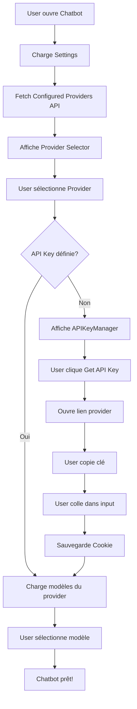

# 📦 PACKAGE COMPLET CHATBOT PRO - BOLT-DIY

## 🎯 Vue d'ensemble

Ce package contient TOUS les fichiers nécessaires pour créer un chatbot professionnel avec :
- ✅ Sélection de providers AI (OpenAI, Anthropic, Google, etc.)
- ✅ Sélection de modèles dynamique
- ✅ Gestion des clés API avec interface UI
- ✅ Bouton "Get API Key" pointant vers la page du provider
- ✅ Sauvegarde sécurisée (cookies/localStorage)
- ✅ Interface settings complète

---

## 📁 Structure des fichiers

```
📦 CHATBOT PRO PACKAGE
│
├── 1️⃣ COMPOSANTS UI CHAT
│   ├── APIKeyManager.tsx          ← Gestion clés API avec bouton Get Key
│   ├── ModelSelector.tsx          ← Sélection provider + modèle
│   └── Chat.client.tsx            ← Interface de chat
│
├── 2️⃣ SETTINGS SYSTEM (COMPLET)
│   ├── core/
│   │   ├── ControlPanel.tsx       ← Panel principal settings
│   │   ├── types.ts               ← Types TypeScript
│   │   └── constants.tsx          ← Constantes & configs
│   │
│   └── tabs/providers/
│       ├── CloudProvidersTab.tsx  ← Config providers cloud
│       └── LocalProvidersTab.tsx  ← Config providers locaux
│
├── 3️⃣ STATE MANAGEMENT
│   ├── stores/settings.ts         ← Store Nanostores pour settings
│   └── hooks/useSettings.ts       ← Hook React pour settings
│
├── 4️⃣ TYPES & CONSTANTS
│   ├── types/model.ts             ← Interfaces Provider/Model
│   └── utils/constants.ts         ← Liste providers & configs
│
└── 5️⃣ API ROUTES (Backend)
    ├── api.models.$provider.ts    ← Récupération modèles
    ├── api.check-env-key.ts       ← Vérification clés ENV
    └── api.configured-providers.ts ← Providers configurés
```

---

## 📋 FICHIERS DÉTAILLÉS

### 1️⃣ COMPOSANTS UI CHAT

#### 📄 `APIKeyManager.tsx`
**Localisation:** `bolt-diy/app/components/chat/APIKeyManager.tsx`

**Fonctionnalités:**
- ✅ Champ input pour entrer la clé API (type password)
- ✅ Bouton "Edit" pour modifier la clé
- ✅ Bouton "Get API Key" avec lien vers provider (ex: platform.openai.com)
- ✅ Sauvegarde automatique dans cookies
- ✅ Indicateur visuel si clé définie (UI ou ENV)
- ✅ Support multi-providers

**Props:**
```typescript
interface APIKeyManagerProps {
  provider: ProviderInfo;           // Info du provider
  apiKey: string;                   // Clé API actuelle
  setApiKey: (key: string) => void; // Callback pour sauvegarder
  getApiKeyLink?: string;           // URL page création clé
  labelForGetApiKey?: string;       // Label bouton "Get API Key"
}
```

**Exemple d'utilisation:**
```tsx
<APIKeyManager
  provider={selectedProvider}
  apiKey={apiKey}
  setApiKey={setApiKey}
/>
```

---

#### 📄 `ModelSelector.tsx`
**Localisation:** `bolt-diy/app/components/chat/ModelSelector.tsx`

**Fonctionnalités:**
- ✅ Dropdown pour sélectionner le provider (OpenAI, Claude, etc.)
- ✅ Dropdown pour sélectionner le modèle du provider
- ✅ Recherche fuzzy (levenshtein distance)
- ✅ Filtres (ex: modèles gratuits pour OpenRouter)
- ✅ Affichage tokens max par modèle
- ✅ Navigation clavier (arrow keys, Enter, Escape)
- ✅ Indicateur de loading

**Props:**
```typescript
interface ModelSelectorProps {
  model?: string;                        // Modèle sélectionné
  setModel?: (model: string) => void;    // Callback modèle
  provider?: ProviderInfo;               // Provider sélectionné
  setProvider?: (provider: ProviderInfo) => void; // Callback provider
  modelList: ModelInfo[];                // Liste tous modèles
  providerList: ProviderInfo[];          // Liste providers
  apiKeys: Record<string, string>;       // Clés API
  modelLoading?: string;                 // Indicateur loading
}
```

---

### 2️⃣ SETTINGS SYSTEM (COMPLET)

#### 📄 `ControlPanel.tsx`
**Localisation:** `bolt-diy/app/components/@settings/core/ControlPanel.tsx`

**Fonctionnalités:**
- ✅ Modal principal des settings
- ✅ Navigation entre tabs (providers, features, data, etc.)
- ✅ Gestion de l'état des tabs
- ✅ Avatar dropdown avec profil utilisateur
- ✅ Animations & transitions
- ✅ Gestion des notifications/badges

**Key Features:**
```typescript
- Lazy loading des tabs
- Gestion du state activeTab
- Back navigation
- Keyboard shortcuts (Escape)
- Responsive design (1200px modal)
```

---

#### 📄 `CloudProvidersTab.tsx`
**Localisation:** `bolt-diy/app/components/@settings/tabs/providers/cloud/CloudProvidersTab.tsx`

**Fonctionnalités:**
- ✅ Liste TOUS les providers cloud (15+ providers)
- ✅ Toggle enable/disable par provider
- ✅ Configuration base URL personnalisée
- ✅ Icônes pour chaque provider (SiOpenai, SiGoogle, etc.)
- ✅ Descriptions des providers
- ✅ Détection ENV variables
- ✅ Toggle "Enable All Cloud"

**Providers supportés:**
```typescript
- OpenAI, Anthropic, Google, Cohere
- Deepseek, Groq, Mistral, Perplexity
- OpenRouter, Together, XAI, HuggingFace
- Hyperbolic, AmazonBedrock, Github
```

---

### 3️⃣ STATE MANAGEMENT

#### 📄 `stores/settings.ts`
**Localisation:** `bolt-diy/app/lib/stores/settings.ts`

**Fonctionnalités:**
- ✅ Store Nanostores (léger, performant)
- ✅ Persistance localStorage automatique
- ✅ Auto-détection providers configurés via API
- ✅ Gestion enable/disable providers
- ✅ Configuration base URLs
- ✅ Tracking providers auto-enabled

**Key exports:**
```typescript
export const providersStore = map<ProviderSetting>()
export const updateProviderSettings = (provider, settings) => {}
export const initializeProviders = async () => {}

// Settings stores
export const latestBranchStore
export const autoSelectStarterTemplate
export const enableContextOptimizationStore
export const isEventLogsEnabled
export const promptStore
```

---

#### 📄 `hooks/useSettings.ts`
**Localisation:** `bolt-diy/app/lib/hooks/useSettings.ts`

**Fonctionnalités:**
- ✅ Hook React pour accéder aux settings
- ✅ Providers actifs/inactifs
- ✅ Callbacks pour mettre à jour settings
- ✅ Gestion theme, language, notifications
- ✅ Tab configuration

**Interface:**
```typescript
export interface UseSettingsReturn {
  // Providers
  providers: Record<string, IProviderConfig>;
  activeProviders: ProviderInfo[];
  updateProviderSettings: (provider: string, config: IProviderSetting) => void;

  // Settings
  settings: Settings;
  setTheme: (theme: 'light' | 'dark' | 'system') => void;
  setLanguage: (language: string) => void;

  // Debug
  debug: boolean;
  enableDebugMode: (enabled: boolean) => void;
}
```

---

### 4️⃣ TYPES & CONSTANTS

#### 📄 `types/model.ts`
**Localisation:** `bolt-diy/app/types/model.ts`

```typescript
export type ProviderInfo = {
  staticModels: ModelInfo[];
  name: string;
  getDynamicModels?: (
    providerName: string,
    apiKeys?: Record<string, string>,
    providerSettings?: IProviderSetting,
    serverEnv?: Record<string, string>,
  ) => Promise<ModelInfo[]>;
  getApiKeyLink?: string;        // ← URL pour obtenir clé API
  labelForGetApiKey?: string;    // ← Label bouton (ex: "Get OpenAI Key")
  icon?: string;                 // ← Icône provider
};

export interface IProviderSetting {
  enabled?: boolean;
  baseUrl?: string;
  OPENAI_LIKE_API_MODELS?: string;
}

export type IProviderConfig = ProviderInfo & {
  settings: IProviderSetting;
};
```

---

#### 📄 `utils/constants.ts`
**Localisation:** `bolt-diy/app/utils/constants.ts`

**Contenu:**
```typescript
// Liste de TOUS les providers disponibles
export const PROVIDER_LIST = llmManager.getAllProviders();

// Provider par défaut
export const DEFAULT_PROVIDER = llmManager.getDefaultProvider();

// Mapping des ENV keys
export const providerBaseUrlEnvKeys: Record<string, {
  baseUrlKey?: string;
  apiTokenKey?: string
}> = {};

// Templates de démarrage
export const STARTER_TEMPLATES: Template[] = [...]
```

---

### 5️⃣ API ROUTES (Backend)

#### 📄 `api.models.$provider.ts`
**Localisation:** `bolt-diy/app/routes/api.models.$provider.ts`

**Fonctionnalités:**
- ✅ Récupération dynamique des modèles d'un provider
- ✅ Support clés API cookies + ENV
- ✅ Cache des modèles
- ✅ Error handling

**Endpoint:** `GET /api/models/:provider`

---

#### 📄 `api.check-env-key.ts`
**Localisation:** `bolt-diy/app/routes/api.check-env-key.ts`

**Fonctionnalités:**
- ✅ Vérifier si clé API définie dans ENV
- ✅ Retourne `{ isSet: boolean }`
- ✅ Sécurisé (ne retourne jamais la clé)

**Endpoint:** `GET /api/check-env-key?provider=OpenAI`

---

#### 📄 `api.configured-providers.ts`
**Localisation:** `bolt-diy/app/routes/api.configured-providers.ts`

**Fonctionnalités:**
- ✅ Liste providers configurés sur serveur
- ✅ Détection automatique ENV variables
- ✅ Retourne status + méthode de config

**Endpoint:** `GET /api/configured-providers`

**Response:**
```json
{
  "providers": [
    {
      "name": "OpenAI",
      "isConfigured": true,
      "configMethod": "environment"
    }
  ]
}
```

---

## 🔧 CONFIGURATION DES PROVIDERS

### Configuration dans LLMManager

Chaque provider est configuré avec :

```typescript
{
  name: 'OpenAI',
  staticModels: [
    { name: 'gpt-4o', label: 'GPT-4o', maxTokenAllowed: 128000 },
    { name: 'gpt-4-turbo', label: 'GPT-4 Turbo', maxTokenAllowed: 128000 },
    // ...
  ],
  getDynamicModels: async (providerName, apiKeys) => {
    // Fetch modèles depuis API
  },
  getApiKeyLink: 'https://platform.openai.com/api-keys',
  labelForGetApiKey: 'Get OpenAI API Key',
  icon: 'i-ph:openai-logo'
}
```

### Liens "Get API Key" par provider

```typescript
const API_KEY_LINKS = {
  OpenAI: 'https://platform.openai.com/api-keys',
  Anthropic: 'https://console.anthropic.com/settings/keys',
  Google: 'https://makersuite.google.com/app/apikey',
  Groq: 'https://console.groq.com/keys',
  Cohere: 'https://dashboard.cohere.com/api-keys',
  Mistral: 'https://console.mistral.ai/api-keys',
  Perplexity: 'https://www.perplexity.ai/settings/api',
  Deepseek: 'https://platform.deepseek.com/api_keys',
  OpenRouter: 'https://openrouter.ai/keys',
  XAI: 'https://console.x.ai/team',
  Together: 'https://api.together.xyz/settings/api-keys',
  HuggingFace: 'https://huggingface.co/settings/tokens',
}
```

---

## 🎨 STYLES & UI

### Tailwind Classes utilisées

```css
/* Buttons */
bg-bolt-elements-background-depth-2
hover:bg-bolt-elements-background-depth-3
text-bolt-elements-textPrimary

/* Inputs */
border-bolt-elements-borderColor
focus:ring-2 focus:ring-bolt-elements-focus

/* Status indicators */
text-green-500  /* API key définie */
text-red-500    /* API key manquante */
text-purple-500 /* Actions principales */

/* Modals */
rounded-2xl shadow-2xl
backdrop-blur-sm
```

### Animations

```typescript
// Framer Motion
initial={{ opacity: 0, y: 20 }}
animate={{ opacity: 1, y: 0 }}
transition={{ duration: 0.3 }}

whileHover={{ scale: 1.02 }}
whileTap={{ scale: 0.95 }}
```

---

## 🚀 INTÉGRATION DANS TON PROJET

### 1️⃣ Installation dépendances

```bash
npm install nanostores @nanostores/react js-cookie
npm install framer-motion @radix-ui/react-dialog
npm install react-icons lucide-react
```

### 2️⃣ Structure minimale

```
src/
├── components/
│   ├── chat/
│   │   ├── APIKeyManager.tsx
│   │   └── ModelSelector.tsx
│   └── settings/
│       ├── ControlPanel.tsx
│       └── CloudProvidersTab.tsx
├── lib/
│   ├── stores/
│   │   └── settings.ts
│   └── hooks/
│       └── useSettings.ts
└── types/
    └── model.ts
```

### 3️⃣ Exemple usage complet

```tsx
import { APIKeyManager } from '@/components/chat/APIKeyManager';
import { ModelSelector } from '@/components/chat/ModelSelector';
import { useSettings } from '@/lib/hooks/useSettings';

function ChatbotPro() {
  const { providers, activeProviders } = useSettings();
  const [selectedProvider, setSelectedProvider] = useState(null);
  const [selectedModel, setSelectedModel] = useState(null);
  const [apiKey, setApiKey] = useState('');

  return (
    <div>
      {/* Sélection Provider & Modèle */}
      <ModelSelector
        provider={selectedProvider}
        setProvider={setSelectedProvider}
        model={selectedModel}
        setModel={setSelectedModel}
        modelList={modelList}
        providerList={activeProviders}
        apiKeys={{ [selectedProvider?.name]: apiKey }}
      />

      {/* Gestion clé API */}
      {selectedProvider && (
        <APIKeyManager
          provider={selectedProvider}
          apiKey={apiKey}
          setApiKey={setApiKey}
        />
      )}

      {/* Zone de chat */}
      <ChatInterface
        provider={selectedProvider}
        model={selectedModel}
        apiKey={apiKey}
      />
    </div>
  );
}
```

---

## 🔒 SÉCURITÉ

### ⚠️ Points critiques

1. **NE JAMAIS exposer les clés API côté client en production**
   ```typescript
   // ❌ MAUVAIS - exposé dans le frontend
   const API_KEY = 'sk-proj-xxx';

   // ✅ BON - proxy backend
   fetch('/api/chat', {
     method: 'POST',
     body: JSON.stringify({ message, provider, model })
   });
   ```

2. **Utiliser des variables d'environnement**
   ```env
   OPENAI_API_KEY=sk-proj-xxx
   ANTHROPIC_API_KEY=sk-ant-xxx
   GOOGLE_GENERATIVE_AI_API_KEY=xxx
   ```

3. **Cookies sécurisés**
   ```typescript
   Cookies.set('apiKeys', JSON.stringify(keys), {
     secure: true,      // HTTPS only
     sameSite: 'strict',
     expires: 7         // 7 jours
   });
   ```

---

## 📊 FLOW COMPLET



---

## 🧪 TESTING

### Test manuel checklist

- [ ] Sélection provider fonctionne
- [ ] Liste modèles se met à jour
- [ ] Input clé API sauvegarde correctement
- [ ] Bouton "Get API Key" ouvre bon lien
- [ ] Indicateur "Set via UI" s'affiche
- [ ] Cookies persistent après refresh
- [ ] Settings modal s'ouvre/ferme
- [ ] Toggle enable/disable provider

---

## 🐛 TROUBLESHOOTING

### Providers ne s'affichent pas
```typescript
// Vérifier le store
import { providersStore } from '~/lib/stores/settings';
console.log(providersStore.get());
```

### Modèles ne chargent pas
```typescript
// Vérifier l'API
const res = await fetch('/api/models/OpenAI');
const data = await res.json();
console.log(data);
```

### Clé API ne sauvegarde pas
```typescript
// Vérifier les cookies
import Cookies from 'js-cookie';
console.log(Cookies.get('apiKeys'));
```

---

## 📚 RESSOURCES COMPLÉMENTAIRES

### Documentation officielles
- [Nanostores](https://github.com/nanostores/nanostores)
- [Radix UI Dialog](https://www.radix-ui.com/docs/primitives/components/dialog)
- [Framer Motion](https://www.framer.com/motion/)

### Providers API Docs
- [OpenAI API](https://platform.openai.com/docs/api-reference)
- [Anthropic API](https://docs.anthropic.com/claude/reference/getting-started-with-the-api)
- [Google Gemini](https://ai.google.dev/docs)

---

## ✅ CHECKLIST FINALE

Avant de passer à l'IA de développement, assure-toi d'avoir :

- [ ] Tous les fichiers listés ci-dessus
- [ ] Les dépendances npm nécessaires
- [ ] La structure de ton backend pour proxy API calls
- [ ] Les variables d'environnement configurées
- [ ] Le système de routing (React Router / Next.js)
- [ ] Le système de styling (Tailwind configuré)

---

## 💡 PROMPT POUR L'IA

```markdown
Je veux créer un chatbot professionnel standalone basé sur le système bolt-diy.

FONCTIONNALITÉS REQUISES :
1. Interface de chat moderne et responsive
2. Sélection de provider AI (OpenAI, Anthropic, Google, etc.)
3. Sélection de modèle selon le provider
4. Gestion des clés API avec :
   - Input sécurisé (type password)
   - Bouton "Get API Key" qui ouvre le bon lien
   - Sauvegarde dans cookies/localStorage
   - Indicateur visuel (clé définie ou non)
5. Panel settings complet pour configurer providers
6. Backend proxy pour appels API sécurisés

CONTRAINTES TECHNIQUES :
- React + TypeScript
- Tailwind CSS pour le styling
- Nanostores pour state management
- API routes pour backend
- Sécurité : NE JAMAIS exposer clés API côté client

FICHIERS DE RÉFÉRENCE :
[Voir ci-dessus - tous les fichiers complets]

Adapte ce code pour créer un chatbot standalone production-ready.
```

---

## 🎯 RÉSULTAT ATTENDU

Un chatbot professionnel avec :
- ✅ UI moderne et intuitive
- ✅ Multi-providers (15+ options)
- ✅ Gestion sécurisée des clés
- ✅ Workflow complet : sélection → config → chat
- ✅ Persistance des settings
- ✅ Responsive design
- ✅ Error handling robuste

---

**Date:** 2025-12-02
**Version:** 1.0
**Source:** bolt-diy (fork optimisé)
